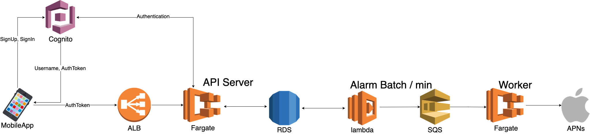
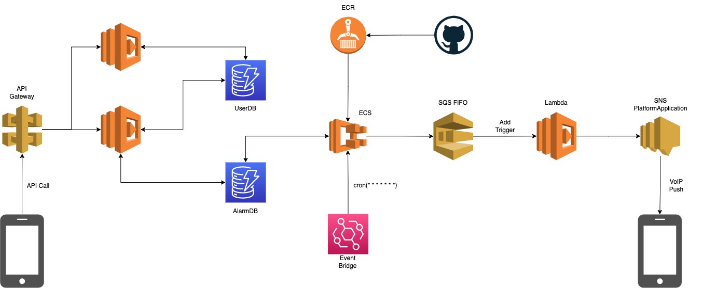

# CharalarmBackend

## 概要

Charalarm は2次元のキャラクターに起こされたい！というtakoikatakotakoの思いを叶えてお金も稼ぐために作る個人開発のモバイルアプリです。 ユーザーはモーニングコールをして欲しいキャラクターをアプリ内で選択しアラームをセットします。 アラームをセットした時間に電話に女の子から電話がかかってきて幸せな起床を実現できます。

またキャラクターは同人ゲーム界隈の人から素材を頂こうと思っています。 同人ゲームサークルの人は既存の素材などからアラームアプリを作ることができる、小野はアプリ内にキャラクターが増えて幸せ。というWinWinの関係になるのが目標です。

## 現行アーキテクチャ

Charalarm の現行のアーキテクチャです。 
お金がないのでRDS, SNS, SSQ, S3だけ使って、API, Batch, Worker はConohaVPSに詰め込んでいます。

## 新アーキテクチャ

Charalarmの新しいアーキテクチャです。
現行のアーキテクチャではサービスの維持手数料が高い & スケールアップが面倒なのでサーバーレス中心の構成にしました。

## ドキュメント

- [APIのエンドポイントについて](document/api-endpoint.md)
- [Curlについて](document/curl.md)
- [Localstackについて](document/localstack.md)
- [Conohaサーバーのセットアップについて](documents/Conoha-Setup.md)
- [ConohaサーバーのAPIセットアップについて](documents/Conoha-API.md)
- [ConohaサーバーのBatchセットアップについて](documents/Conoha-Batch.md)
- [ConohaサーバーのWorkerセットアップについて](documents/Conoha-Worker.md)
- [Conohaサーバーのアップデートについて](documents/Conoha-Update.md)

